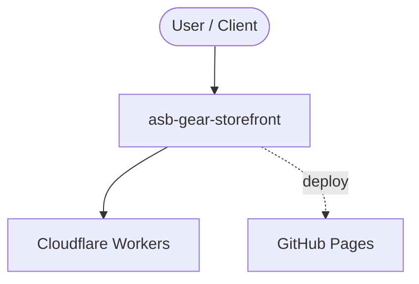

# Context Map — `asb-gear-storefront`

> Auto-generated architecture & deployment context map. Summarizes the core application, container/cloud footprint, and database connections. Regenerate after significant structural changes.

**Repo:** `avnit/asb-gear-storefront` · **Original** · Public · Primary language: HTML · Default branch: `main` · Files: 25

**Description:** ASB Gear — pre-launch storefront for the ASB Solutions Group hardware line (USB-C dock + magnetic car charger mount)

## 1. Core application

ASB Gear — storefront

## 2. Containers & cloud applications

**Detected cloud platforms / services:** Cloudflare Workers, Netlify, GitHub Pages

## 3. Database connections

_No database drivers or connection strings detected._

## 4. Architecture diagram

## 5. Security posture

- **Static scan findings:** 8 medium

| Severity | Rule | File:Line |
|---|---|---|
| medium | js-innerhtml | `assets/js/cart.js:118` |
| medium | js-innerhtml | `assets/js/cart.js:177` |
| medium | js-innerhtml | `assets/js/cart.js:242` |
| medium | js-innerhtml | `assets/js/cart.js:329` |
| medium | js-innerhtml | `assets/js/cart.js:335` |
| medium | js-innerhtml | `assets/js/shop.js:97` |
| medium | js-innerhtml | `assets/js/shop.js:112` |
| medium | js-innerhtml | `assets/js/shop.js:139` |

---
_Generated by repo context-mapping pass on 2026-08-13._